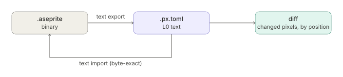
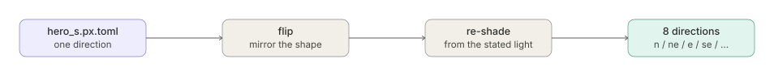
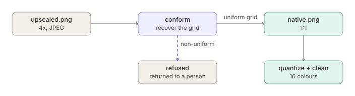
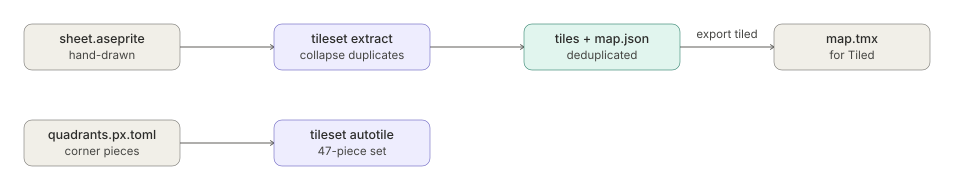
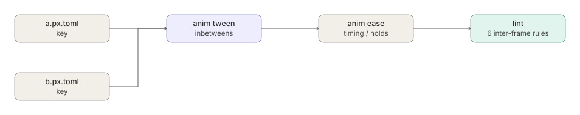
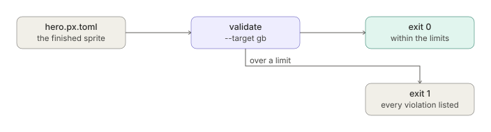
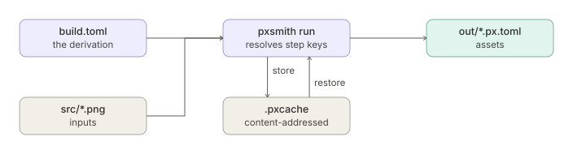
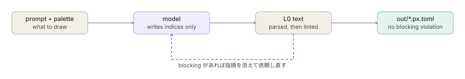
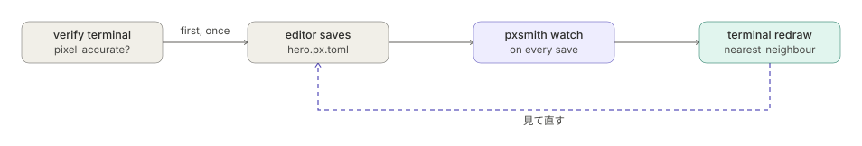
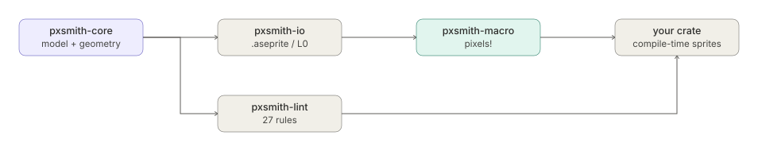

# ユースケース

[English](usecases.md) | **日本語**

[← README へ戻る](https://github.com/akitenkrad/rs-pxsmith/blob/main/README.ja.md)

pxsmith が対象としているのは，絵を描くこと自体ではなく，その周辺にある作業です．
以下の各項では，やりたいこと，解決の方針，実行するコマンドの順に記載します．引数の
詳細は[コマンドライン](cli.ja.md)にあります．

---

## 1. プルリクエストでスプライトの変更をレビューする

### やりたいこと

バイナリである `.aseprite` ファイルは差分を取れないため，スプライトの変更はレビューの
場に「ファイルが変わった」という情報としてしか届きません．どの画素が動いたのかは，
エディタを開かなければ分かりません．

### 解決方針

レイヤを L0 テキストへ変換し，そちらをレビュー対象にします．往復はバイト単位で一致
するため，テキストをレビューの対象としながら `.aseprite` を作業用ファイルとして保つ
ことができます．

<p align="center"></p>

`diff` は変化した画素を数え，その位置を要約統計ではなく 1 件ずつ報告します．ドット絵
では 1 画素の違いが意味を持つためです．

### コマンド

```sh
pxsmith text export hero.aseprite hero.px.toml --palette pal.hex
pxsmith diff old.px.toml hero.px.toml
pxsmith text import hero.px.toml hero.aseprite
```

---

## 2. 1 枚の絵から 8 方向を導出する

### やりたいこと

キャラクタを 8 方向ぶん描くということは，8 枚のスプライトの一貫性を保ち続けるという
ことです．1 枚を反転するだけでは足りません．陰影も一緒に反転してしまい，光源が動いて
見えるためです．

### 解決方針

1 方向だけ描いて残りを導出します．陰影は塗るのではなく導出しているため，反転した
スプライトに対して元の光源から陰影を付け直すことができます．

<p align="center"></p>

### コマンド

```sh
pxsmith direction 'out/${dir}.px.toml' --from s=hero_s.px.toml \
    --light dir:-0.6,0.8 --reshade
```

出力先には `${dir}` を含める必要があります．方向ごとに 1 ファイルを書き出すためです．

---

## 3. 拡大された状態で届いた絵を復元する

### やりたいこと

Web から集めたドット絵，誤った倍率で書き出された素材，画像モデルが生成した絵は，
たいてい拡大された状態で届き，JPEG 圧縮を経ていることも多くあります．目分量で縮小
すると元の格子が失われますし，色数はすでに膨れ上がっています．

### 解決方針

格子を復元して等倍へ戻し，そのうえで扱えるインデックスカラーへ落とします．

<p align="center"></p>

格子が一様でない場合，`conform` は推測せずに拒否します．非一様な格子は決定論的に復元
できないためです．

### コマンド

```sh
pxsmith conform upscaled.png native.png
pxsmith quantize native.png indexed.png --colors 16 --method kmeans
pxsmith clean indexed.png cleaned.png
```

---

## 4. 手描きのシートからタイルセットを組む

### やりたいこと

シートをタイルに切って重複を除く作業は機械的で，手で行うと退屈なうえ，細かいところを
取り違えやすいものです．象限から 47 枚のオートタイルを組む作業はさらに面倒です．

### 解決方針

同値なタイルを自動的に束ねてマップを併せて書き出し，象限からオートタイルを構成して
地図エディタ向けに書き出します．

<p align="center"></p>

入力はインデックスカラーである必要があります．ここで量子化を行うと，どのタイルを同一と
みなすかをツール自身の色の選択が決めてしまうためです．

### コマンド

```sh
pxsmith tileset extract sheet.aseprite tiles.aseprite --tile 16 --map map.json
pxsmith tileset autotile quadrants.px.toml auto.aseprite
pxsmith export tiled map.json map.tmx --sheet out/sheet.json
```

---

## 5. 2 枚のキーフレームの間を埋める

### やりたいこと

中割りは描くのが単調であるうえ，そこで生じた誤りは 1 コマずつ見ても分かりません．
線の揺れや，物体が動いてもディザが画布に貼り付いたままになる現象は，動かして初めて
現れます．

### 解決方針

2 枚のキーから中割りを計算し，タイミングは別に調整します．そのうえで，検査を 1 コマ
単位ではなく列に対して掛けます．

<p align="center"></p>

### コマンド

```sh
pxsmith anim tween out.px.toml --from a.px.toml --to b.px.toml --base 8A6A4A
pxsmith anim ease walk.px.toml eased.px.toml --fps 30 --hold 2,1,1,1,2
pxsmith anim squash in.px.toml out.px.toml --amount -0.3
pxsmith lint out.px.toml
```

---

## 6. ハードウェア制約に照らす

### やりたいこと

レトロプラットフォーム向けの制作では，パレットやタイルの上限を描いている最中に超えて
しまいやすく，しかも絵が仕上がってから気付くと修正が面倒です．

### 解決方針

制約の検査をビルドの一部として実行します．違反があれば非ゼロで終了するため，そのまま
CI に組み込めます．

<p align="center"></p>

組み込みの出力先は `gb`・`nes`・`snes`・`gba`・`pico8` で，それ以外は TOML の
プロファイルを渡せます．

### コマンド

```sh
pxsmith validate hero.px.toml --target gb
pxsmith validate hero.px.toml --target nes --json
```

---

## 7. CI でアセットパイプラインを回す

### やりたいこと

シェルスクリプトとして持っている導出手順は機械ごとにずれていきますし，再実行すると
何も変わっていなくても全部を作り直します．

### 解決方針

導出をデータとして記述します．ステップキーが逐次的に決まるため，変わっていない工程を
実行することなく「変わっていない」と判定できます．

<p align="center"></p>

64 枚に対する 128 ステップで，冷えた状態が 2.66 秒，温まった状態が 0.09 秒です．入力を
1 つ変更した場合は，それに依存する 2 ステップだけが再ビルドされます．スレッド数を変えて
も出力はバイト単位で同じであり，これは主張ではなく試験で確かめています．詳しくは
[レシピ](recipes.ja.md)を参照してください．

### コマンド

```sh
pxsmith run build.toml --dry-run   # 順序だけ出す．何も走らせない
pxsmith run build.toml
```

---

## 8. プロトタイプ中の仮素材を用意する

### やりたいこと

素材を待つ間プロトタイプが止まってしまいますが，生成させた絵はたいてい，パレットが
違うか，寸法が違うか，プロジェクトが宣言していない色を含んでいます．

### 解決方針

モデルには色ではなくパレットの添字を書かせ，返ってきたものを手描きの絵と同じ lint で
検証し，落ちた場合は指摘を添えて依頼し直します．

<p align="center"></p>

パレットはツールが先に書き出す別ファイルの `.hex` にあるため，生成されたスプライトが
プロジェクトの宣言していない色を持ち込むことはありません．このループが何を検証し，何を
検証していないかは[生成](generation.ja.md)にあります．

### コマンド

```sh
export ANTHROPIC_API_KEY=...
pxsmith gen prog out/chest.px.toml --prompt "木の宝箱．正面から" \
    --palette 1a1c2c,566c86,8a6a4a,b13e53,f4f4f4 --size 16x16
```

---

## 9. 端末で確認しながら描く

### やりたいこと

L0 テキストをエディタで編集していると絵が目に入りませんし，どの端末でも画素を判断
できるほど忠実に表示できるわけではありません．

### 解決方針

保存のたびに描き直します．そのうえで，その端末が信用してよいかを先に判定します．

<p align="center"></p>

`verify terminal` が答えるのは，画像を表示できるかどうかではなく，1 画素を判断する
用途に耐えるかどうかです．半ブロックによる代替表示は垂直解像度が半分になるため，
これには該当しません．

### コマンド

```sh
pxsmith verify terminal
pxsmith watch hero.px.toml --zoom 8
pxsmith view walk.px.toml --frame 2 --onion 2
```

---

## 10. CLI を介さずライブラリとして使う

### やりたいこと

独自のビルドシステムを持つプロジェクトからバイナリを呼び出すのは避けたいものですし，
パスで参照しているスプライトはコンパイラに気付かれないまま失われることがあります．

### 解決方針

同じ操作をライブラリの関数として呼び出します．スプライトをコンパイル時に埋め込めば，
壊れているものはコンパイルエラーになります．

<p align="center"></p>

### コマンド

```rust
use pxsmith_macro::pixels;

let frames = pixels!("sprites/hero_body.px.toml");
```

行の長さが揃っていない場合はコンパイルエラーになり，参照しているパレットを編集すると
再ビルドが走ります．クレートの分割と，`pxsmith-view` を端末表示の実装なしで取り込む
方法は[ライブラリ](library.ja.md)にあります．

---

## pxsmith が対象としないこと

描画のための UI もキャンバスも持たず，Aseprite をはじめとするエディタの代わりには
なりません．また，作者が決めるべき事柄を代わりに決めることもしません．`conform` は
非一様な格子を推測せずに拒否し，`project` は投影の指定を推測せず宣言させ，
`palette report` は 4 通りの割合を並べて 1 つに決めません．
